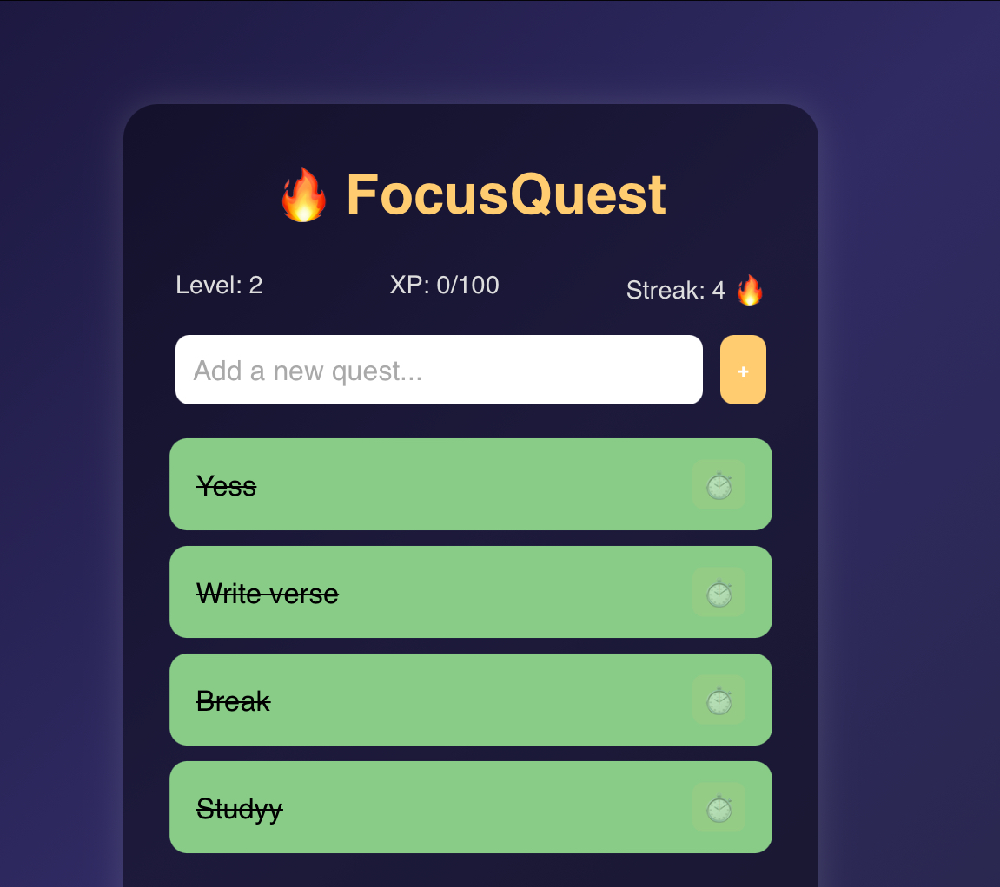
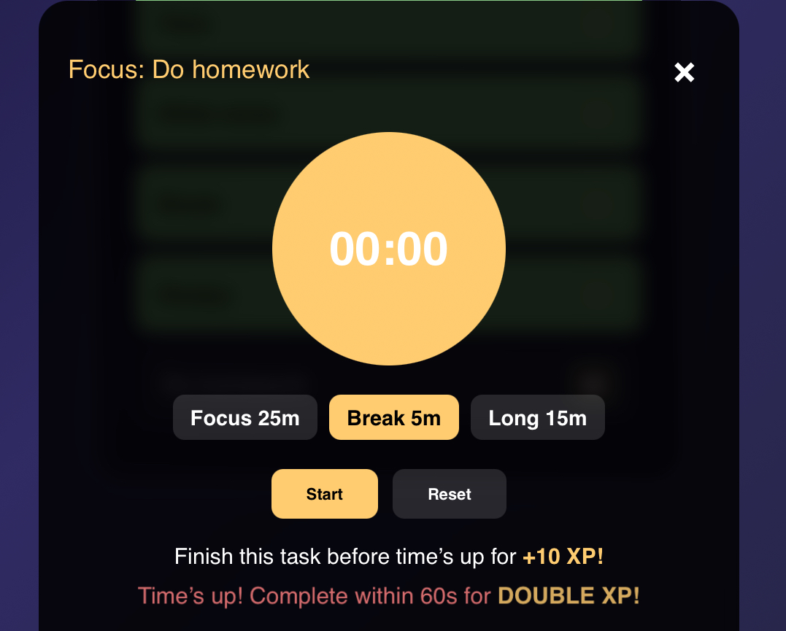

# 🧠 Addictive To-Do App (name pending)

Welcome to the **most dangerously addictive** to-do list app on the internet — built with nothing but **HTML, CSS, and JavaScript**. Designed to **rewire your brain** to crave task completion, this isn't just productivity... it's productivity **gamified**.

> _"Just one more task..."_  
> — You, every 5 minutes

---

## ⚡️ Features

> **Built for obsession. Shipped as MVP. Ready to grow.**

✅ Beautiful UI that *feels* satisfying  
✅ Smooth animations & transitions  
✅ 🎯 Focus Timer (Pomodoro-style) built-in  
✅ Dark/light mode toggle  
✅ Task streaks and completion stats  
✅ Motivational quote generator  
✅ Task sounds + subtle haptics (optional)  
✅ Keyboard shortcuts for power users  
✅ 🎉 Visual celebration effects  
✅ LocalStorage saves all your data  
✅ Progress bars, smart sorting, and more...

---

## ✨ Preview

> _Sleek, minimal, and dopamine-optimized_

### 🏠 Task Manager  


### ⏱️ Focus Timer  


---

## 🚀 Getting Started

### 1. Clone the repo
```bash
git clone https://github.com/yourusername/addictive-todo-app.git
cd addictive-todo-app

2. Open the app

Simply open index.html in your browser. No frameworks. No installs. 100% pure front-end power.

⸻

💡 Philosophy

This app isn’t just about getting things done — it’s about making you want to. Every micro-interaction is optimized to give you that little hit of satisfaction. Complete a task? Visual feedback. Start a timer? Feel locked in. It’s flow state… in a browser tab.

⸻

🛠️ Future Plans

Want more? Here’s what’s next (feel free to contribute):

	•	🎮 Task leveling system (RPG-style)
	•	🔄 Daily and weekly habits
	•	📊 Productivity analytics dashboard
	•	🧠 AI-powered task clarity assistant
	•	☁️ Optional cloud sync + auth
	•	📱 Mobile PWA mode

⸻

Author

Built by Shaurya — passionate about productivity, design, and making your browser just a bit more dangerous.

💬 Feel free to open issues or submit PRs — let’s build the most addictive task app together.

⸻

📸 Contributing Screenshots?

If you take cool screenshots or want to contribute visuals for the README, just drop them in /assets/ and reference them above!

⸻

📄 License

MIT — free to use, remix, and modify. Attribution appreciated but not required.

⸻

🔥 Made so I can do stuff

---
